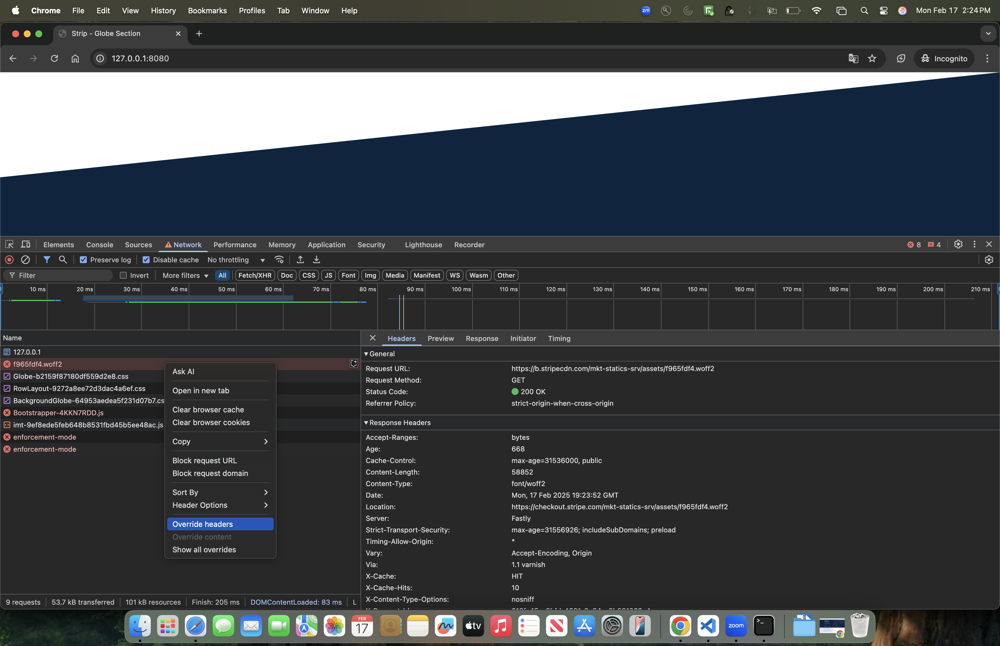
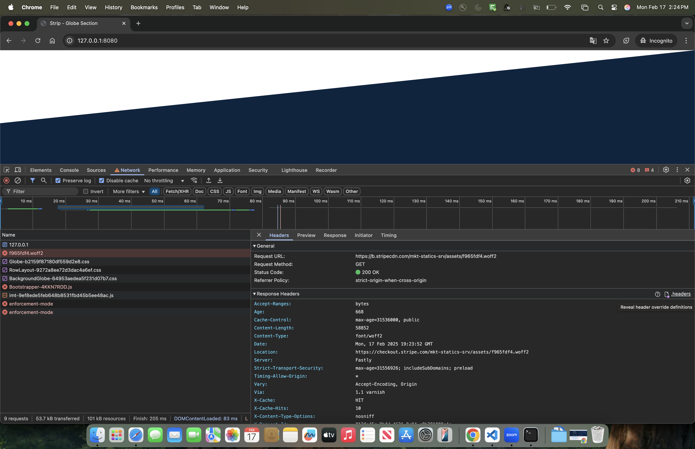
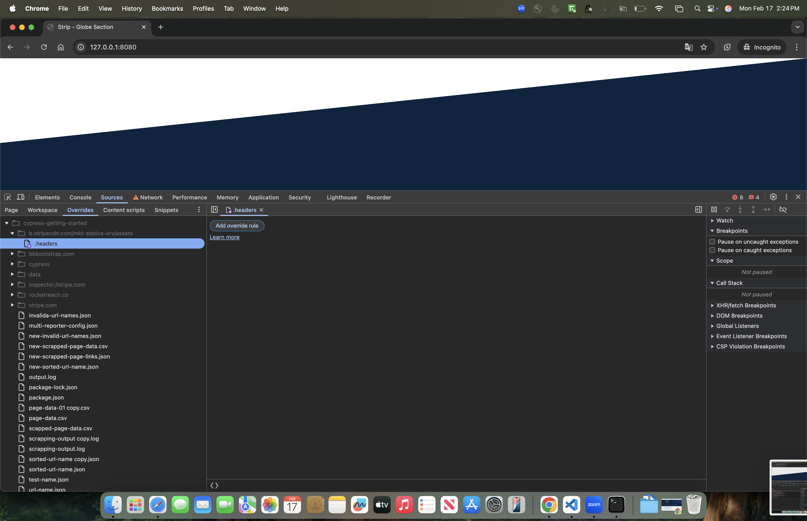
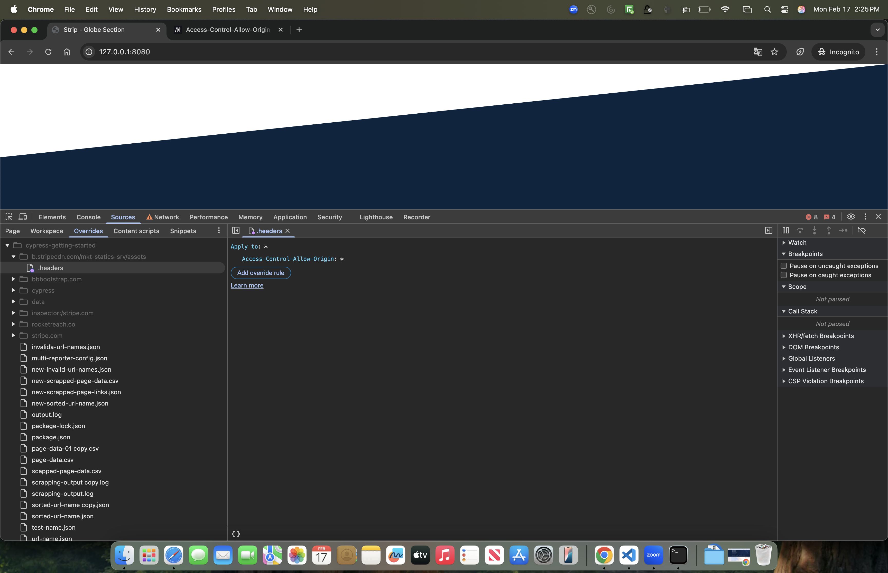

# Running `index.html` with `http-server`

## Prerequisites

Make sure you have Node.js and npm installed. You can download them from [nodejs.org](https://nodejs.org/).

## Running the Server

1. Using npx you can run the script without installing it first:

    ```sh
    cd /path/to/your/project
    npx http-server
    ```

3. Open your browser and go to `http://127.0.0.1:8080/` to see your content of `index.html`.


## CORS configs to load content from Strip site.

1. Click on network call which is failing because of CORS issue & right click on it.
2. Click on `Override Headers` option on it. Ref. {:height="36px" width="36px"}
3. Click on `.Headers` option Ref. 
4. Click on `Add override rule` button. Ref. 
5. Add header `Access-Control-Allow-Origin` as `*` for all. Ref. 
6. Keep the devtool open to keep the above changes effective.


## Additional Information

For more options and configurations, refer to the [http-server documentation](https://www.npmjs.com/package/http-server).